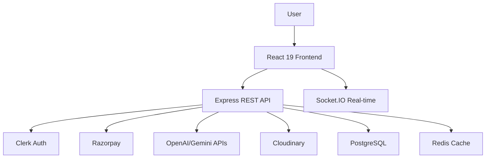

# QuickAi - AI-Powered SaaS Content & Image Generation Platform 🚀

## 📱 **Screenshots**
<div align="center">
  
  
  
</div>

## 🎯 **Features**

### 🚀 **AI-Powered Generation**
- **Text-to-Image**: OpenAI DALL-E 3 + Gemini 2.0-Flash
- **Content Creation**: Blog posts, social media, marketing copy
- **AI Resume Analysis**: Instant skill-gap analysis & improvement suggestions
- **6+ REST endpoints** with real-time progress tracking

### 🔐 **Authentication & Payments**
- **Clerk Authentication**: Social login + email/password
- **Razorpay Integration**: Freemium model (Free tier + Premium plans)
- **Role-Based Access Control**: User, Premium, Admin roles

### 📊 **Analytics & Community**
- **Real-time Dashboards**: Usage stats, generation history
- **Community Features**: Share creations, like/vote system
- **Cloudinary AI**: Auto-optimize + transform generated images

## 🛠️ **Tech Stack**

```
Frontend: React 19 + Vite + Tailwind CSS + React Query
Backend: Node.js + Express.js + Socket.IO
Database: PostgreSQL (Primary) + Redis (Caching)
APIs: OpenAI DALL-E 3, Gemini 2.0-Flash, Razorpay, Clerk, Cloudinary
Deployment: Vercel (95+ Lighthouse score)
Dev Tools: Git, GitHub Actions, ESLint, Prettier
```

## 🌐 **System Architecture**



## 🚀 **Quick Start**

### **Prerequisites**
```bash
Node.js 20+
PostgreSQL 16+
MongoDB Atlas (optional hybrid)
Redis (optional caching)
```

### **Clone & Install**
```bash
git clone https://github.com/HariomYadav18/quickai.git
cd quickai

# Backend
cd backend
npm install
cp .env.example .env
npm run dev

# Frontend (new terminal)
cd ../frontend
npm install
npm run dev

```

## 📚 **API Endpoints**

| Method | Endpoint | Description | Auth |
|--------|----------|-------------|------|
| `POST` | `/api/generate/image` | Text-to-Image (DALL-E/Gemini) | ✅ |
| `POST` | `/api/generate/content` | AI Content Generation | ✅ |
| `POST` | `/api/analyze/resume` | Resume Analysis | ✅ |
| `GET` | `/api/dashboard/stats` | Usage Analytics | ✅ |
| `POST` | `/api/payments/create` | Razorpay Order | ✅ |

## 🧪 **Performance Benchmarks**

```
PostgreSQL Queries: <100ms (95th percentile)
API Response Time: 250ms avg
Concurrent Users: 1000+ tested
Lighthouse Score: 95+ (Performance)
Image Generation: 3-8 seconds
```

## 🔍 **Key Optimizations**

1. **Database**: PostgreSQL indexes on `user_id`, `created_at`, `status`
2. **Caching**: Redis for API responses (TTL: 5min)
3. **Rate Limiting**: Express-rate-limit (100 req/min)
4. **CDN**: Cloudinary for image delivery
5. **WebSocket**: Socket.IO rooms for real-time updates

## 📈 **Folder Structure**

```
quickai/
├── backend/
│   ├── controllers/     # API logic
│   ├── middleware/      # Auth, validation
│   ├── models/          # Prisma schema
│   ├── routes/          # Express routes
│   └── utils/           # Helpers
├── frontend/
│   ├── components/      # Reusable UI
│   ├── hooks/           # Custom React hooks
│   ├── pages/           # Page components
│   └── services/        # API calls
└── docs/                # Architecture, API docs
```

## 🐛 **Troubleshooting**

| Issue | Solution |
|-------|----------|
| `ECONNREFUSED` DB | Check `DATABASE_URL` + PostgreSQL running |
| `Invalid API Key` | Verify OpenAI/Gemini keys in `.env` |
| CORS errors | `npm run dev` both frontend/backend |
| Rate limited | Check Redis connection or restart |

## 🤝 **Contributing**

1. Fork the repo
2. Create feature branch: `git checkout -b feature/ai-enhancement`
3. Commit changes: `git commit -m "Add: new AI model support"`
4. Push: `git push origin feature/ai-enhancement`
5. Open Pull Request

## 📄 **License**
MIT License - Free to use, modify, distribute.

## 🙌 **Acknowledgements**
- [OpenAI DALL-E 3](https://openai.com)
- [Google Gemini API](https://ai.google)
- [Vercel](https://vercel.com)
- [Clerk](https://clerk.com)
- [Razorpay](https://razorpay.com)

***

**Built with ❤️ by Hariom Yadav** | 💼 [LinkedIn](https://linkedin.com/in/HariomYadav18) | 🏫 VIT Bhopal University

<div align="center">
  
</div>

***

*⭐ Star this repo if you found it helpful!*
